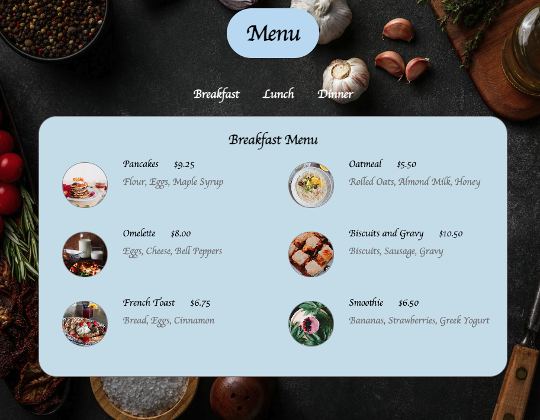
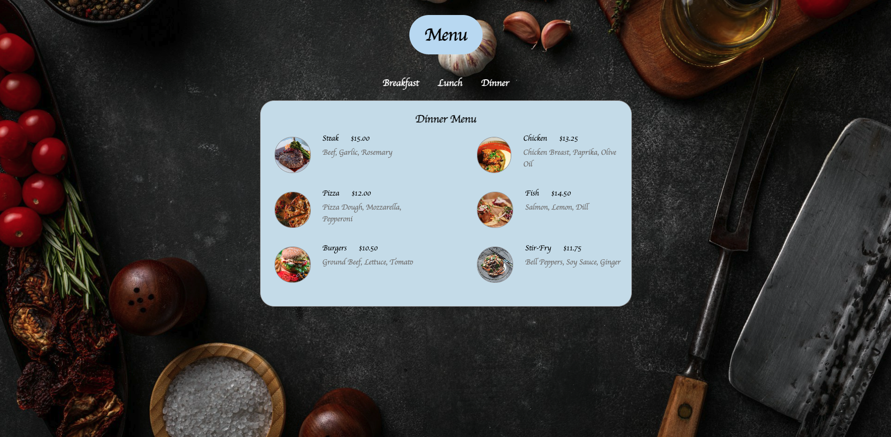

# Restaurant Menu

## Table of Contents
1. [Project Overview](#project-overview)
2. [Features](#features)
3. [Technologies Used](#technologies-used)
4. [Setup](#setup)
5. [Usage](#usage)
6. [Screenshots](#screenshots)
7. [Future Enhancements](#future-enhancements)

## Project Overview
This project is a static restaurant menu web page showing a cafe's breakfast, lunch, and dinner options. It uses HTML and CSS to organize menu items and implement a visually appealing layout for users. The page is responsive, adapting to different screen sizes for better user experience.

## Features 
* Responsive design: Works well on both desktop and mobile devices.
* Navigation: Users can view different meal sections (breakfast, lunch, dinner) by clicking links, revealing relevant menu items.
* Styled layout: Includes background images, custom fonts, and neatly arranged menu items with images, names, prices, and ingredients.

## Technologies Used
* HTML
* CSS

## Setup
1. Clone the repository to your local machine.
2. Open the project folder.
3. Run index.html in your browser to view the restaurant menu.

## Usage
Navigate through the menu by clicking on "Breakfast," "Lunch," or "Dinner" links. The sections display menu items with images, names, prices, and ingredients, organized into two columns for easy reading.

## Screenshots

## Future Enhancements
* Adding JavaScript for animated transitions between menu sections.
* Expanding menu items with descriptions or dietary icons (vegan, gluten-free, etc.).
